# Nourish & Share

**Beacon Collaborative | Mentor Me Collective × Grow with Google BUILD Capstone**
**UN Sustainable Development Goal 2: Zero Hunger**

Nourish & Share is a web-based **Surplus Food Redistribution Network** designed to connect organizations with surplus food to organizations that can receive and distribute it.

---

## Team

**Beacon Collaborative**

* **Rezha Zulfachryan Edmanda** — Project Management Grow with Google Track
* **Zacharias Braetyllo** — Cybersecurity Grow with Google Track
* **Zainab Haruna** — Data Analytics Grow with Google Track
* **Kelvin Aklobessi** — IT Support Grow with Google Track
* **Samuel Mercy Oluwatobi** — IT Automation with Python Grow with Google Track

---

## Official Problem Statement

> Local grocery vendors dump surplus perishable items due to a lack of an automated, hyper-local coordination hub for local pantries.

---

## Our Solution

Nourish & Share provides a shared digital platform for coordinating surplus-food redistribution between donor organizations, recipient organizations, and administrators.

The platform reduces friction in the redistribution process through:

* Organization onboarding and approval
* Surplus-food donation management
* Food discovery and filtering
* Reservation workflows
* Pickup coordination
* Lightweight mapping
* Administrative oversight
* Role-based access
* IT health monitoring

The current implementation is an **MVP focused on demonstrating the complete core redistribution workflow** while keeping future enhancements from blocking delivery.

---

## Live Project

### Production Application

**https://beacon-food-network.web.app**

---

## Demo Video

### Project Demo

**https://drive.google.com/file/d/1fxL5y6mJi7fxIVwA5UgETErOWmxzbNFZ/view?usp=drivesdk**

---

# Current Production Screenshots

These screenshots reflect the final integrated Nourish & Share MVP.

## Public Homepage

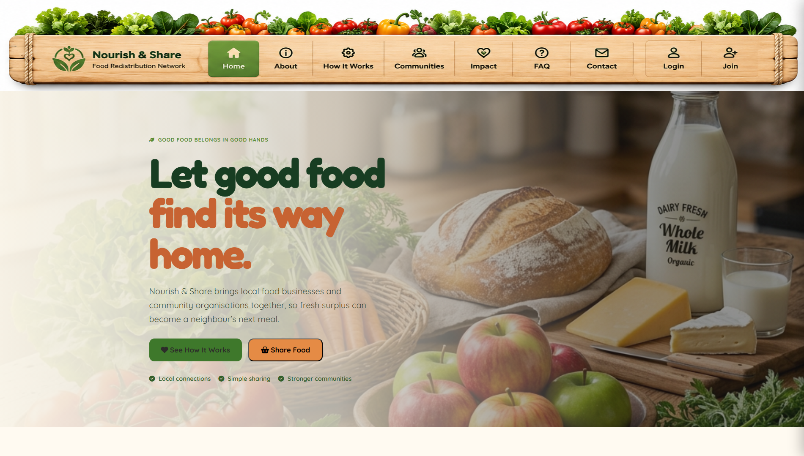

## Donor Dashboard

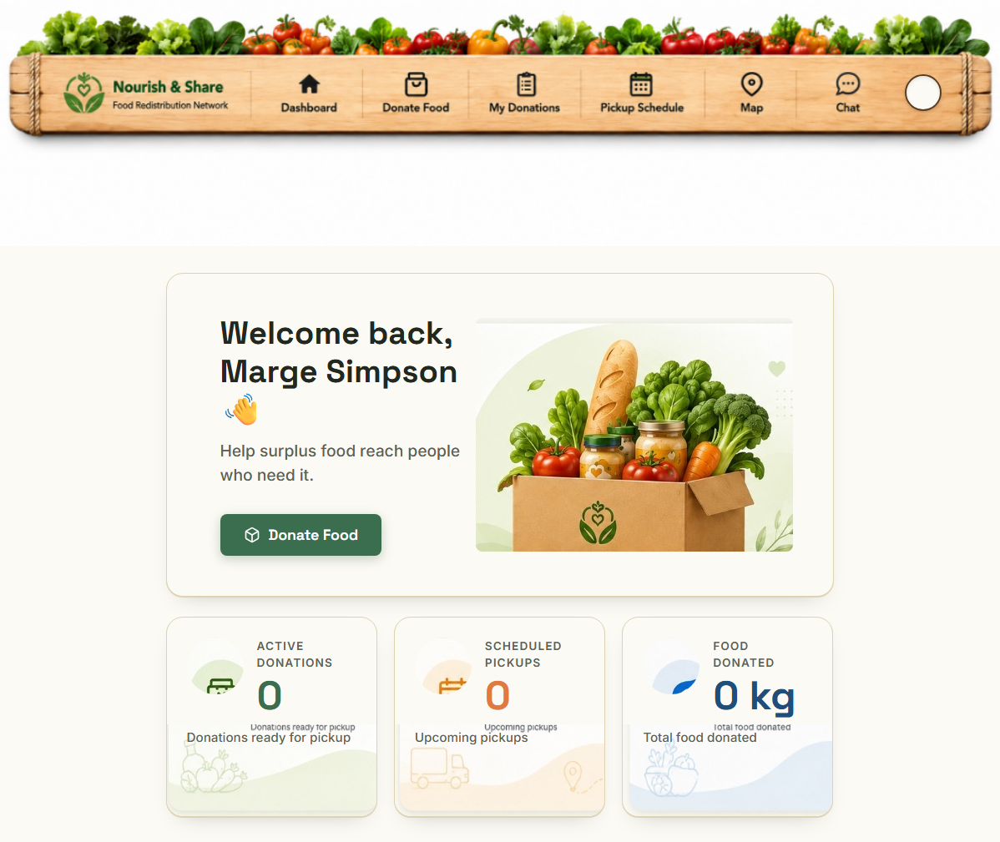

## Recipient Dashboard

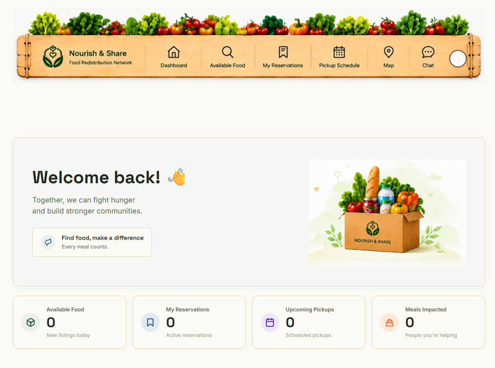

## Admin Dashboard

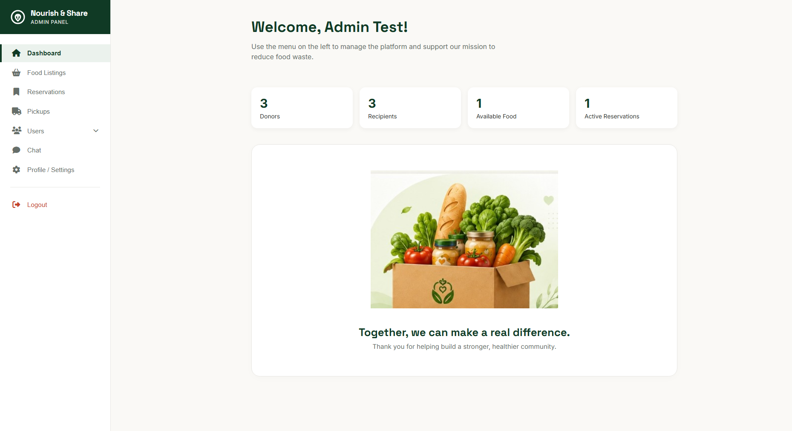

## IT System Health Monitor

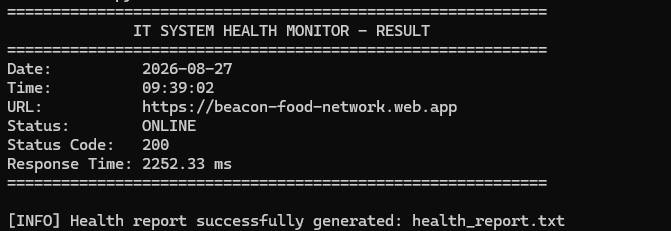

---

# Design & UX Assets

In addition to the current production screenshots, the repository includes design, interface, navigation, and UX-reference assets created during the BUILD process.

These materials document Donor, Recipient, Admin, reservation, navigation, responsive-layout, and public-site concepts used throughout development.

## Donor Interface

### Donor Dashboard — Desktop

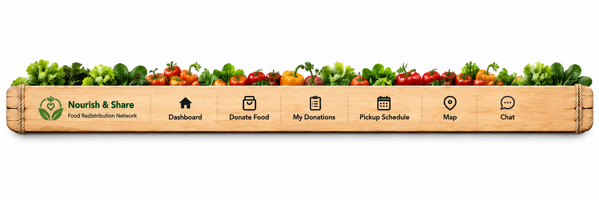

### Donor Dashboard — Mobile

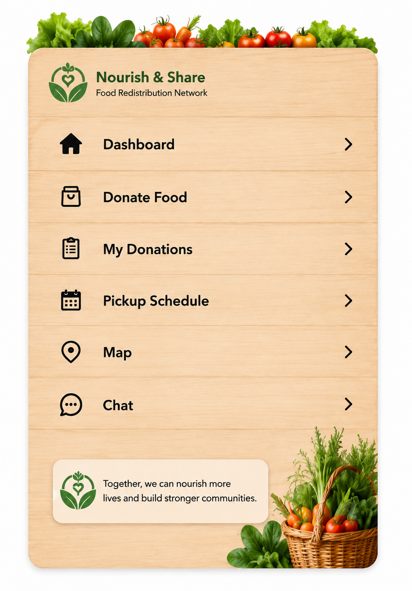

### Donor Visual

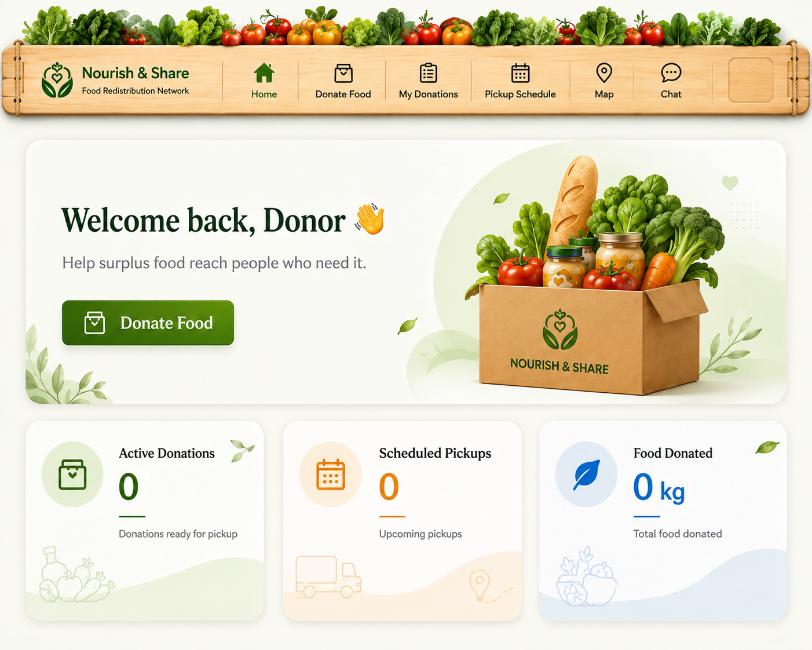

### Donor About Reference

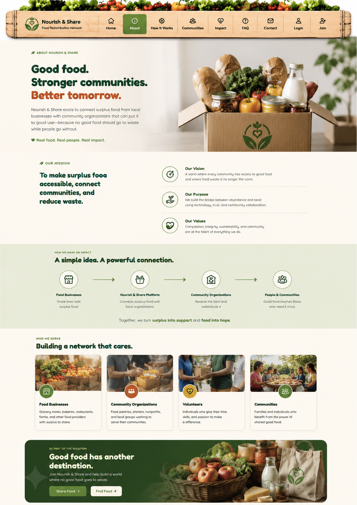

### Donor Communities Reference

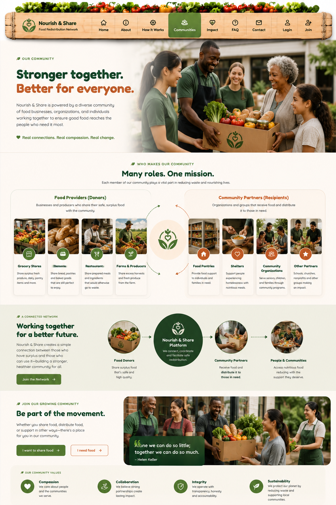

### Donor How It Works Reference

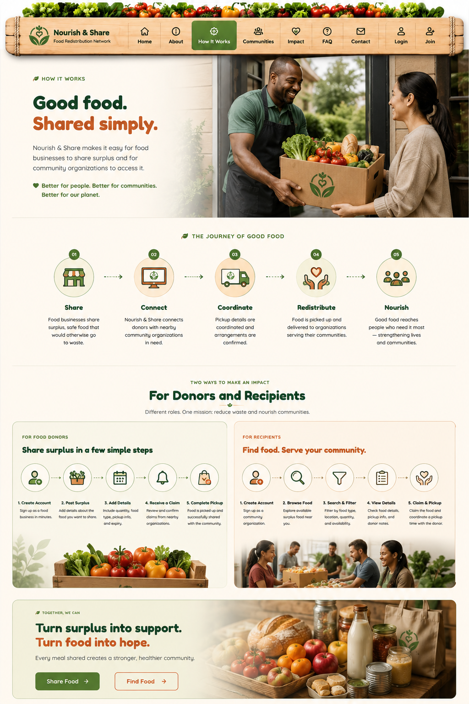

## Recipient Interface

### Recipient Visual

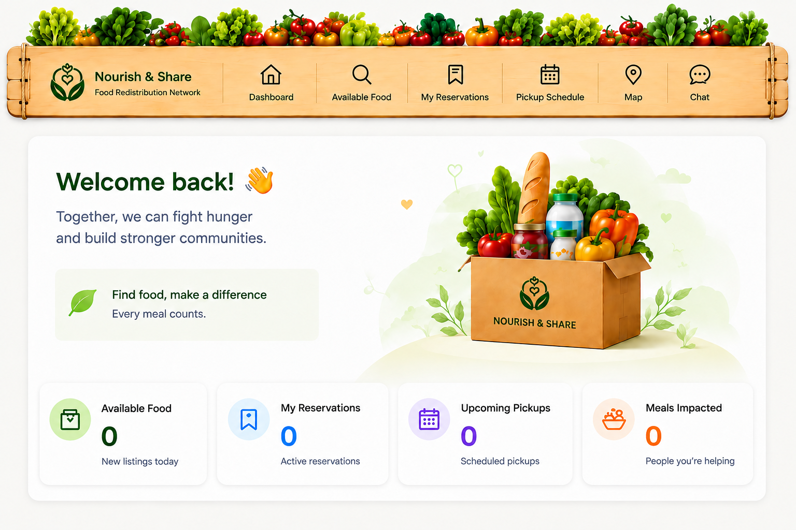

### Recipient Mobile Navigation

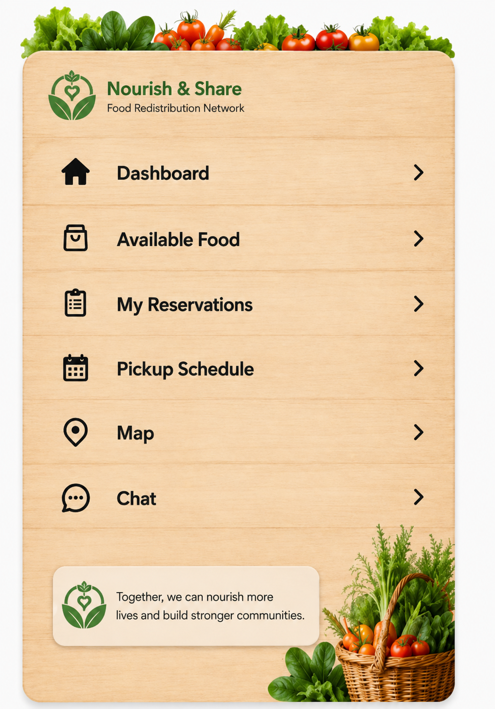

## Reservation Experience

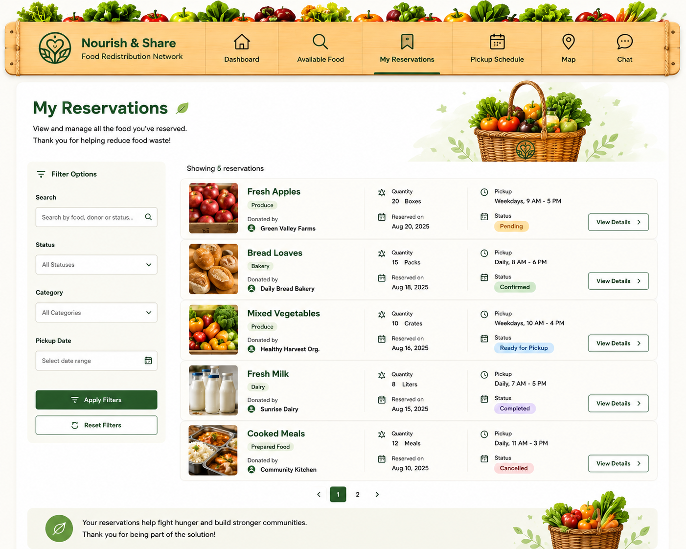

## Public Website Navigation

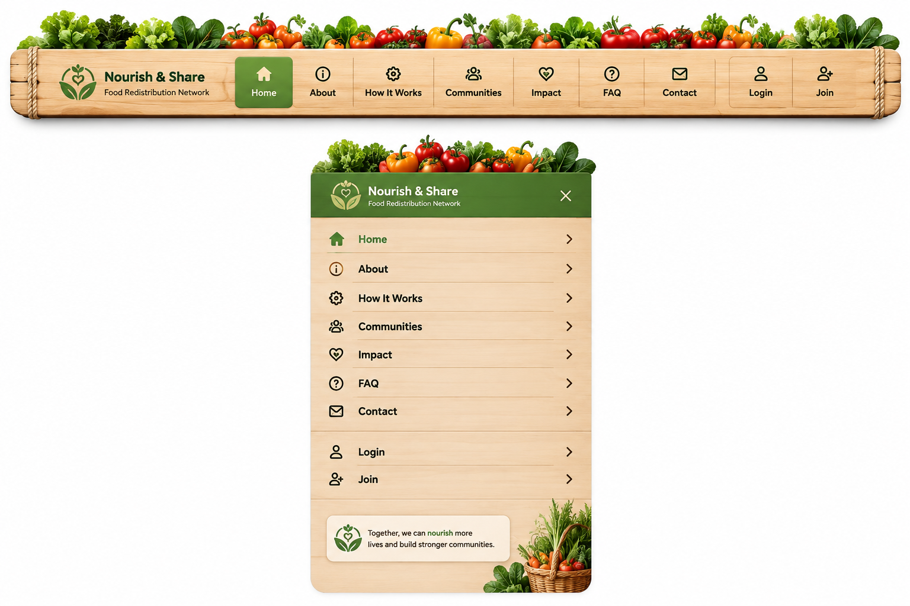

## Administrative Interface

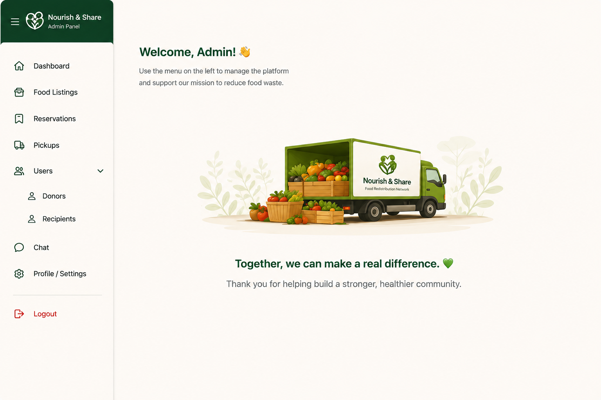

The complete design collection is available in the [`design/`](design/) directory.

---

# Core Features

## Public Experience

The public-facing experience provides:

* Project and program information
* Donor and Recipient entry points
* Organization registration
* Organization onboarding
* Access to the broader Nourish & Share platform

## Donor Experience

Approved Donor organizations can:

* Create surplus-food donation listings
* Manage active donations
* Track donation-related activity
* Coordinate pickups
* Use lightweight location and mapping support

## Recipient Experience

Approved Recipient organizations can:

* Discover available surplus food
* Search and filter listings
* Reserve eligible donations
* Coordinate food collection
* Track reservation and pickup activity
* Use lightweight location and mapping support

## Admin Experience

Administrators can:

* Review pending organizations
* Approve or reject organization access
* Oversee users and organizations
* Review donation listings
* Review reservations
* Review pickups
* Support approval-related communication
* Maintain platform oversight

Pending organizations remain restricted until their organization has been reviewed and approved.

---

# Research & Data

Research and data analysis informed the structure and feature decisions behind the Nourish & Share MVP.

Key findings included:

* Surplus food is highly time-sensitive.
* Organizations may struggle to discover available donations quickly.
* Communication delays can interrupt redistribution.
* Trust and organizational verification matter.
* Donors, Recipients, and Administrators require different workflows.

These findings informed:

* Donation discovery
* Search and filtering
* Organization verification
* Role-specific user experiences
* Mapping support
* Communication workflows
* Administrative approval processes

The current project uses a **Chicago pilot context** for its research and data work.

Supporting materials are available in [`data/`](data/):

* `Beacon_Collaborative Analytics_Report.docx`
* `Beacon_Collaborative_Problem_Grounding_Report (2).docx`
* `Beacon_Collaborative_Research_Summary.docx`
* `Chicago_datasets.csv`

---

# Technology Stack

## Frontend

* HTML
* CSS
* JavaScript
* Firebase
* Leaflet
* OpenStreetMap

## Backend & Platform Services

* Firebase Authentication
* Cloud Firestore
* Firebase Hosting
* Firebase client SDKs

## IT Automation

* Python
* HTTP-based production-site monitoring

## Development & Collaboration

* Git
* GitHub
* Visual Studio Code

---

# Backend Architecture

Nourish & Share uses Firebase as its application platform.

### Firebase Project

`beacon-food-network`

The application uses shared platform data across Donor, Recipient, and Admin workflows rather than maintaining disconnected copies of donation, reservation, or pickup records.

The implementation includes:

* Firebase Authentication integration
* Cloud Firestore-backed application data
* Organization approval state
* Donation creation and retrieval
* Reservation workflows
* Role-aware application behavior
* Firebase Security Rules
* Supporting backend tests and documentation

Detailed architecture documentation:

`docs/Nourish_and_Share_Backend_Architecture_Firebase_Implementation_Documentation.docx`

---

# Security

Cybersecurity is incorporated directly into the Nourish & Share MVP.

Controls include:

* Role-based application access
* Separate Donor, Recipient, and Admin experiences
* Restrictions for organizations awaiting approval
* Controlled administrative access
* Firestore Security Rules
* Protection of sensitive credentials and configuration
* Risk-management documentation

Detailed cybersecurity documentation:

`docs/Cybersecurity Architecture & Risk Management Documentation - FINAL IMPLEMENTATION.docx`

---

# IT Automation & Health Monitoring

The project includes a standalone **Version 1 IT System Health Monitor** developed in Python.

The health monitor:

* Checks whether the production Nourish & Share site is reachable
* Reports `ONLINE` or `OFFLINE` status
* Records the HTTP status code
* Records a timestamp
* Measures response time
* Generates a health report

The monitor operates independently from the primary web application.

```text
it-automation/
├── health_monitor.py
├── health_report.txt
└── requirements.txt
```

---

# How to View the Project

The easiest way to review Nourish & Share is through the deployed production application:

**https://beacon-food-network.web.app**

The repository contains the source code, research, documentation, design materials, project summary, and IT automation work supporting the MVP.

---

# Repository Structure

```text
team-beacon-collaborative/
│
├── data/
│   ├── Beacon_Collaborative Analytics_Report.docx
│   ├── Beacon_Collaborative_Problem_Grounding_Report (2).docx
│   ├── Beacon_Collaborative_Research_Summary.docx
│   └── Chicago_datasets.csv
│
├── design/
│   ├── readme/
│   │   ├── homepage.png
│   │   ├── donor-dashboard.png
│   │   ├── recipient-dashboard.png
│   │   ├── admin-dashboard.png
│   │   └── it-health-monitor.png
│   │
│   └── additional design and UX reference assets
│
├── docs/
│   ├── backend architecture documentation
│   ├── cybersecurity documentation
│   ├── frontend and UX documentation
│   ├── IT support documentation
│   ├── onboarding reference documents
│   ├── Featured MVP documentation
│   └── Implementation Plan documentation
│
├── it-automation/
│   ├── health_monitor.py
│   ├── health_report.txt
│   └── requirements.txt
│
├── src/
│   ├── frontend/
│   └── backend/
│
├── summary/
│   └── Nourish_and_Share_Project_Summary_FINAL.docx
│
├── firebase.json
└── README.md
```

---

# Implementation Plan

The project followed an MVP-first implementation process:

1. Define the surplus-food redistribution problem.
2. Review supporting research and data.
3. Design the Public, Donor, Recipient, and Admin experiences.
4. Develop onboarding and role-specific workflows.
5. Build donation, discovery, reservation, pickup, and approval functionality.
6. Connect major workflows around shared platform data.
7. Add organization approval restrictions and cybersecurity controls.
8. Add lightweight mapping support.
9. Add Python-based production-site health monitoring.
10. Test, debug, refine, deploy, and package the final submission.

Additional implementation planning:

`docs/Implementation Plan Document.docx`

---

# Documentation

The repository includes cross-functional documentation contributed by the Beacon Collaborative team.

Materials include:

* Cybersecurity architecture and risk-management documentation
* Firebase backend architecture documentation
* Frontend system design and UX documentation
* Donor onboarding reference documentation
* Recipient onboarding reference documentation
* IT Support system operations documentation
* IT Automation documentation
* Featured MVP documentation
* Implementation Plan documentation
* Analytics reports
* Research reports

See [`docs/`](docs/) and [`data/`](data/) for the complete documentation set.

---

# Written Project Summary

The final BUILD written project summary is:

`summary/Nourish_and_Share_Project_Summary_FINAL.docx`

The submission-compliant three-page document covers:

* Problem and Research
* Solution and Current MVP
* Implementation Plan and Delivery
* Cross-Functional Team

---

# MVP Scope & Future Work

The current submission intentionally focuses on functionality required to demonstrate the core surplus-food redistribution workflow.

Potential future enhancements include:

* Volunteer functionality
* A dedicated Admin map
* More advanced mapping and logistics
* Deeper infrastructure monitoring
* Additional analytics and reporting
* Real-time tracking
* Broader geographic expansion
* Additional appropriate food-recovery pathways for surplus that cannot be redistributed for human consumption

These items remain future opportunities and are **not required for the current BUILD MVP**.

---

# UN Sustainable Development Goal 2: Zero Hunger

Nourish & Share aligns with **UN Sustainable Development Goal 2: Zero Hunger** by exploring how technology can reduce friction between organizations with surplus food and organizations serving communities that need access to food resources.

Rather than attempting to solve every food-access challenge at once, Nourish & Share demonstrates a practical local coordination workflow intended to improve:

* Visibility
* Trust
* Organization
* Communication
* Redistribution of available surplus food

---

## Beacon Collaborative

**Mentor Me Collective × Grow with Google BUILD Capstone**

**Nourish & Share — Surplus Food Redistribution Network**
